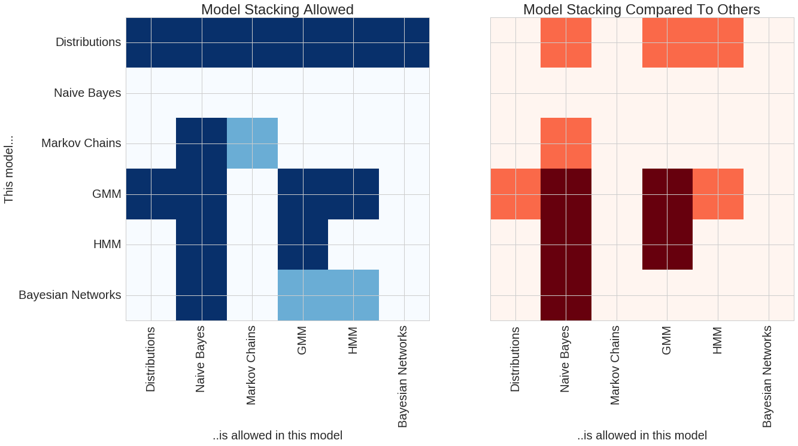

.. _faq:

FAQ
===

**Can I create a usable model if I already know the parameters I want, but don't have data to fit to?**

Yes! pomegranate has two ways of initializing models, either by starting off with pre-initialized distributions or by using the ``Model.from_samples`` class method. In the case where you have a model that you'd like to use you can create the model manually and use it to make predictions without the need to fit it to data.

**How do I create a model directly from data?**

pomegranate attempts to closely follow the scikit-learn API. However, a major area in which it diverges is in the initialization of models directly from data. Typically in scikit-learn one would create an estimator and then call the ``fit`` function on the training data. In pomegranate one would use the ``Model.from_samples`` class method, such as ``BayesianNetwork.from_samples(X)``, to learn a model directly from data.

**My data set has missing values. Can I use pomegranate?**

Yes! pomegranate v0.9.0 merged missing value support. This means that you can learn models and run inference on data sets that have missing values just as easily as if they were fully observed. Indicate that a value is missing using either `numpy.nan` for numeric data sets or `'nan'` in string data sets.

**What is the difference between ``fit`` and ``from_samples``?**

The ``fit`` method trains an initialized model, whereas the ``from_samples`` class method will first initialize the model and then train it. These are separated out because frequently a person already knows a good initialization, such as the structure of the Bayesian network but maybe not the parameters, and wants to fine-tune that initialization instead of learning everything directly from data. This also simplifies the backend by allowing the ``fit`` function to assume that the model is initialized instead of having to check to see if it is initialized, and if not then initialize it. This is particularly useful in structured models such as Bayesian networks or hidden Markov models where the ``Model.from_samples`` task is really structure learning + parameter learning, because it allows the ``fit`` function to be solely parameter learning.

**How can I use pomegranate for semi-supervised learning?**

When using one of the supervised models (such as naive Bayes or Bayes classifiers) simply pass in the label -1 for samples that you do not have a label for.

**How can I use out-of-core learning in pomegranate?**

Once a model has been initialized the ``summarize`` method can be used on arbitrarily sized chunks of the data to reduce them into their sufficient statistics. These sufficient statistics are additive, meaning that if they are calculated for all chunks of a dataset and then added together they can yield exact updates. Once all chunks have been summarized then ``from_summaries`` is called to update the parameters of the model based on these added sufficient statistics. Out-of-core computing is supported by allowing the user to load up chunks of data from memory, summarize it, discard it, and move on to the next chunk.

**Does pomegranate support parallelization?**

Yes! pomegranate supports parallelized model fitting and model predictions, both in a data-parallel manner. Since the backend is written in cython the global interpreter lock (GIL) can be released and multi-threaded training can be supported via joblib. This means that parallelization is utilized time isn't spent piping data from one process to another nor are multiple copies of the model made. 

**Does pomegranate support GPUs?**

Currently pomegranate does not support GPUs.

**Does pomegranate support distributed computing?**

Currently pomegranate is not set up for a distributed environment, though the pieces are currently there to make this possible.

**How can I cite pomegranate?**

I don't currently have a research paper which can be cited, but the GitHub repository can be.

::

	@misc{Schreiber2016,
		author = {Jacob Schreiber},
		title = {pomegranate},
		year = {2016},
		publisher = {GitHub},
		journal = {GitHub repository},
		howpublished = {\url{https://github.com/jmschrei/pomegranate}},
		commit = {enter commit that you used}
	}

**How does pomegranate compare to other packages?**

A comparison of the features between pomegranate and others in the python ecosystem can be seen in the following two plots.

The plot on the left shows model stacks which are currently supported by pomegranate. The rows show each model, and the columns show which models those can fit in. Dark blue shows model stacks which currently are supported, and light blue shows model stacks which are currently being worked on and should be available soon. For example, all models use basic distributions as their main component. However, general mixture models (GMMs) can be fit into both Naive Bayes classifiers and hidden Markov models (HMMs). Conversely, HMMs can be fit into GMMs to form mixtures of HMMs. Soon pomegranate will support models like a mixture of Bayesian networks. 

The plot on the right shows features compared to other packages in the python ecosystem. Dark red indicates features which no other package supports (to my knowledge!) and orange shows areas where pomegranate has an expanded feature set compared to other packages. For example, both pomegranate and sklearn support Gaussian naive Bayes classifiers. However, pomegranate supports naive Bayes of arbitrary distributions and combinations of distributions, such as one feature being Gaussian, one being log normal, and one being exponential (useful to classify things like ionic current segments or audio segments). pomegranate also extends naive Bayes past its "naivity" to allow for features to be dependent on each other, and allows input to be more complex things like hidden Markov models and Bayesian networks. There's no rule that each of the inputs to naive Bayes has to be the same type though, allowing you to do things like compare a markov chain to a HMM. No other package supports a HMM Naive Bayes! Packages like hmmlearn support the GMM-HMM, but for them GMM strictly means Gaussian mixture model, whereas in pomegranate it ~can~ be a Gaussian mixture model, but it can also be an arbitrary mixture model of any types of distributions. Lastly, no other package supports mixtures of HMMs despite their prominent use in things like audio decoding and biological sequence analysis.

Models can be stacked more than once, though. For example, a "naive" Bayes classifier can be used to compare multiple mixtures of HMMs to each other, or compare a HMM with GMM emissions to one without GMM emissions. You can also create mixtures of HMMs with GMM emissions, and so the most stacking currently supported is a "naive" Bayes classifier of mixtures of HMMs with GMM emissions, or four levels of stacking.

**How can pomegranate be faster than numpy?**

pomegranate has been shown to be faster than numpy at updating univariate and multivariate gaussians. One of the reasons is because when you use numpy you have to use ``numpy.mean(X)`` and ``numpy.cov(X)`` which requires two full passes of the data. pomegranate uses additive sufficient statistics to reduce a dataset down to a fixed set of numbers which can be used to get an exact update. This allows pomegranate to calculate both mean and covariance in a single pass of the dataset. In addition, one of the reasons that numpy is so fast is its use of BLAS. pomegranate also uses BLAS, but uses the cython level calls to BLAS so that the data doesn't have to pass between cython and python multiple times.
